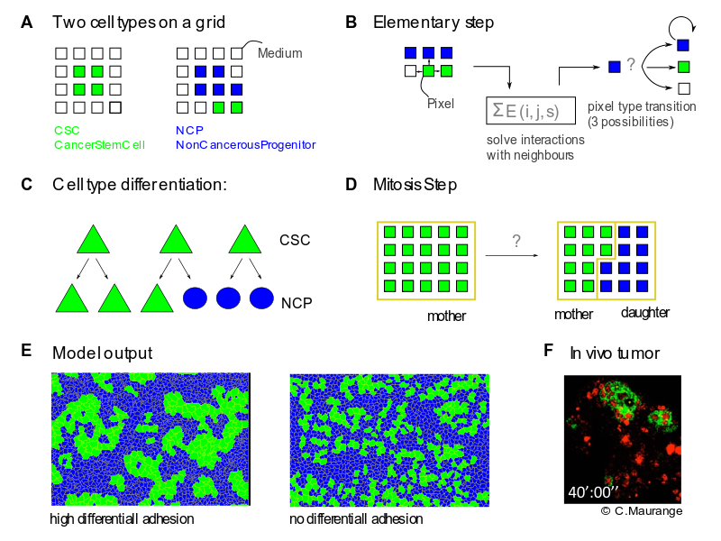
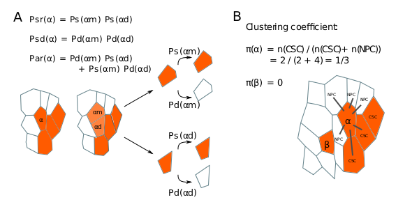
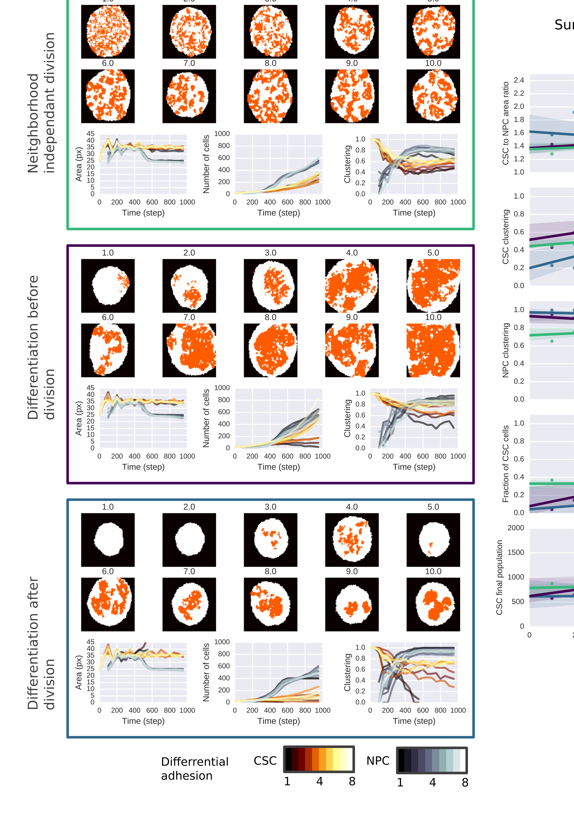

# Analysis of simulation from [CompuCell3D](http://compucell3d.org)

### New differentiation model

#### Previous work

Here is a short reminder of the previous simulation campaign:

In Figure 1 C, mitosis and differentiation are described as a single step process.
As a consequence, three probabilities need to be set:

- symertric renewal Psr
- asymertric renewal Par
- symertric differentiation Psd

To lower the number of parameters, we instead considered differentiation and mitosis as
two separate processes, both daughter cells being independently tested for differention (Figure 2A bellow).

We define the self-renewing probability **Ps** and the differentiating probability **Pd**.
The previous probabilities can be expressed as a function of the new ones, as detailled on the figure bellow
for each daughter cell.

#### New model

We consider 3 scenarios:

- Differentiation is independant from the cells neighborhood
- Differentiation depends on the **mother cell** neighborhood **before** division
- Differentiation depends on the **daughter cells** neighborhoods **after** division

This neighborhood depedence is quantified by stating that the **clustering coefficient** of the cell,
as depicted on figure 2B bellow.

#### Results

The code necessary to reproduce those figures is available in the CancerStemCells_GGH package.
Notebook detailing the usage is there:

`CancerStemCells_GGH/Notebooks/Analysis of the simulation results.ipynb`
