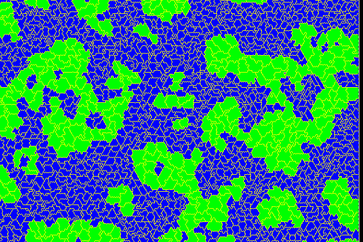
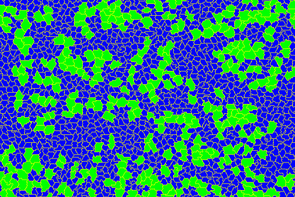

# CancerStemCells_GGH

A  Glazier-Graner-Hogeweg model of tumoral neuroblast proliferation in
drosophila

## We seek to study the mechanism of cell clustering in the tumor

Details can be found in [this document](doc/rapport.md)

## Licence

This work is still private.

This work is &copy; G. Gay and the society DamCB for the simulation code.

[CompuCell3D](https://github.com/CompuCell3D/CompuCell3D) is free software.
License to be determined.  

Biological data are &copy; C. Maurange & the IBDM lab.
