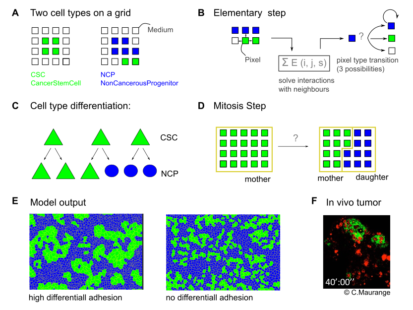

# GGH Simulation of proliferative Neuroblasts Cancer stem cells

## Position of the problem

The cancer stem cell (CSC) hypothesis postulates that tumors are organized
following a cellular hierarchy in which only a subpopulation of cells, the CSCs,
is able to propagate tumor growth by unrestrained self-­‐renewal while also
being able to   generate the more differentiated tumor cells that possess a
limited proliferative potential. The balance between self-­renewal and
differentiation upon division is key to the regulation of the CSC population.
However, because CSCs are usually rare in tumors and difficult to identify, it
has remained difficult to understand how they are regulated. Uncovering the
underlying mechanisms will help designing novel treatments to control or
eliminate the CSC population in malignant tumors. C. Maurange's team identified
a population of CSCs in a Drosophila model of neural tumors. CSCs in these
Drosophila tumors are found in clusters suggesting that the choice between
self‐renewal or differentiation upon division may not be stochastic but rather
constrained by the micro­‐environment or self-­organizing principles. Our aim is
to investigate which parameters regulate cluster formation, and identify the
relevance of the cluster organization in the regulation of cancer and non-­CSC
populations within the tumor. A computer model can be used to predict parameters
regulating cluster formation and the regulation of the CSC population within the
tumor.

The DamCB society was tasked with devising a first explorative model to assert
the interest of the strategy.

There where three steps to this work:

* Identification of the adapted modeling framework
* Installation and configuration of a modeling software
* First round of simulation with minimal hypothesis

## Modeling Framework


Cellular Potts models, or their more recent development Glaziers Gradner Hoggs
(GGH) are well suited for proliferation, clustering and differentiation studies. Indeed, they allow to easily model cell-cell interactions whether those are **biomechanical** (such as adhesion) or **biochemical** (e.g. signaling).

GGH model used here is running on a 2D pixel grid (Fig. 1A). To each pixel is
associated a `type` (here green - CSC, blue - NCP or white - Medium). At each
time step, each pixel on the grid can change state (or color) according to a
stochastic process (Modified Monte Carlo) depending on the pixels energy
associated to the interaction of its neighbours. The state changes that lower the energy are favored.

The simulation models three possible differentiation scenarios, from CSC to NCP (Fig. 1C) through a Mitosis step occurring when cells attain a critical volume (Fig. 1D).




### Logiciel de simulation GGH: CompuCell3D

[CompuCell3D](http://compucell3d.org) has been developed exactly with the GGH
framework in mind, by the framework authors themselves.

This software offers a graphical interface showing the running simulations.
Simulation properties can be specified in various ways.

First, a `.xml` file defines the various cell types and their interactions, for example the adhesion properties.

Second, several python files allow to specify the cells behavior during the simulation, such as differentiation during mitosis.


### Current Model specification in CompuCell3D:

The simulation is comprised of 4 files:

* `Sim2.cc3d` - the container file opened by CompuCell3D
* `Sim2.xml` - Cell types, static porperties
* `Sim2.py` - "main" python module
* `Sim2Steppables.py` - python file specifying the division and growth steps.

The model defines three possible pixel `Types`:

1. The `CancerStemCell` type, representing the proliferative cell line (CSC)
2. The `NonCancerous` type, less proliferative (NCP)
3. The surrounding `Medium`

An excerpt of the `Sim2.xml` is shown bellow:

```xml
  <!- Container for the whole specification of CPM (GGH) algorithm -->
     <Plugin Name="Contact">
        <!-- Specification of adhesion energies -->
        <Energy Type1="CancerStemCell" Type2="CancerStemCell">1.0</Energy>
        <Energy Type1="CancerStemCell" Type2="NonCancerous">10.0</Energy>
        <Energy Type1="NonCancerous" Type2="NonCancerous">1.0</Energy>
        <Energy Type1="Medium" Type2="Medium">10.0</Energy>
        <Energy Type1="Medium" Type2="CancerStemCell">10.0</Energy>
        <Energy Type1="Medium" Type2="NonCancerous">10.0</Energy>
        <NeighborOrder>1</NeighborOrder>
    </Plugin>
```

What we see here is the definition of the adhesion energies between the
different cell types in the differential adhesion scenario. As CSC/CSC and
NCP/NCP adhesion have lower energy (1.0) than all the other interactions (10.0),
it favors clustering.

This adhesion energy is thus the key element to investigate in further studies.


## Python Code

In the file `Sim2Steppables.py` are defined the ways cell grow and devide. The
following lines can be modified to change the division behavior:

```python
### Differentiation probabilities
P_sr = 0.4 # symetric self renewing
P_ar = 0.4 # asymetric self renewing
P_sd = 1 - (P_sr + P_ar) # symetric differentiating
```

## Next steps

Here is a list of the various things we can do further on:

* Systematically explore the adhesion energy parameters.

* Measure and compare clustering in vivo and in silico.
  **Entropy** could be a good candidate for such a quatification.

* Investigate other clustering mechanisms, such as environment dependent
  differentiation.

* Better reflect cell fate by allowing limited number of divisions for NCPs.

* Better data visualization and in vivo/in silico comparisons through CC3D
  `.vtk` output files parsing in IPython Notebook.


[1] Swat, M.H. et al. _Multi-Scale Modeling of Tissues Using CompuCell3D_.
Method Cell Biol 110, 325-366 (2012).
